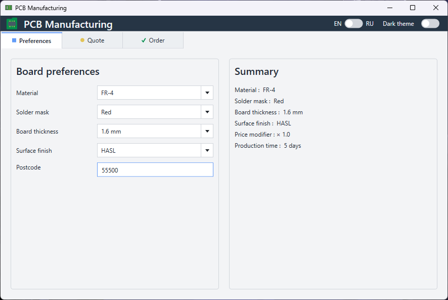

# PCB Manufacturing

A small WPF desktop application for configuring PCB manufacturing options, reviewing the resulting quote, and placing an order.

The project was created as a technical assignment and demonstrates MVVM architecture, dependency injection, validation, theming, localization, persistence, and unit testing.

## Architecture Overview

The application follows the MVVM pattern and separates UI, presentation logic, application state, and infrastructure services.

- **Features** — feature-specific Views and ViewModels for Preferences, Quote, and Order.
- **Models** — shared application state and domain models.
- **Services** — persistence, validation, theme management, localization, and dialog services.
- **Converters** — WPF value converters used by the UI.
- **Resources** — localization resources and light/dark theme dictionaries.
- **Tests** — unit tests for ViewModels, validation, and application logic.

`PcbConfiguration` represents the shared PCB configuration. Changes made in Preferences and Quote are propagated through the shared `PcbConfiguration` instance and reflected across application features.

Dependencies are registered using `Microsoft.Extensions.DependencyInjection`, while `CommunityToolkit.Mvvm` is used for observable properties, commands, and validation.

The PCB configuration is persisted locally as JSON. Localization is based on `.resx` resources, and light/dark themes are implemented with WPF `ResourceDictionary` files.


## Screenshots

### Preferences


### Quote


### Order


### Quote — Dark Theme


## Features

- PCB manufacturing preferences:
  - material
  - solder mask color
  - board thickness
  - surface finish
  - postcode
- Editable board dimensions and layer count
- Quote overview with grouped PCB parameters
- Dynamic PCB preview based on board dimensions, layer count, and solder mask
- Price calculation based on the selected PCB configuration
- Order validation and confirmation
- Light and dark themes
- English and Russian localization
- Local JSON configuration persistence
- Single-instance application behavior
- Unit tests for application logic

## Framework Versions

### Application

- .NET 8
- WPF
- CommunityToolkit.Mvvm 8.4.2
- Microsoft.Extensions.DependencyInjection 8.0.1

### Tests

- xUnit 2.5.3
- xunit.runner.visualstudio 2.5.3
- Microsoft.NET.Test.Sdk 17.8.0
- coverlet.collector 6.0.0

## Build Instructions

### Requirements

- Windows
- .NET 8 SDK

### Build from the command line

Clone the repository and open the repository directory:

```bash
git clone https://github.com/AlexPalex40k/PCBManufacturing.git
cd PCBManufacturing

dotnet restore PCBManufacturing.sln
dotnet build PCBManufacturing.sln --configuration Release
dotnet run --project PCBManufacturing/PCBManufacturing.csproj
dotnet test PCBManufacturing.Tests/PCBManufacturing.Tests.csproj
```