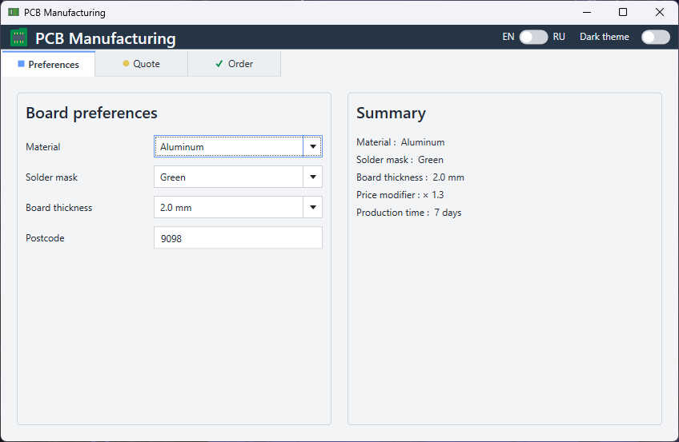
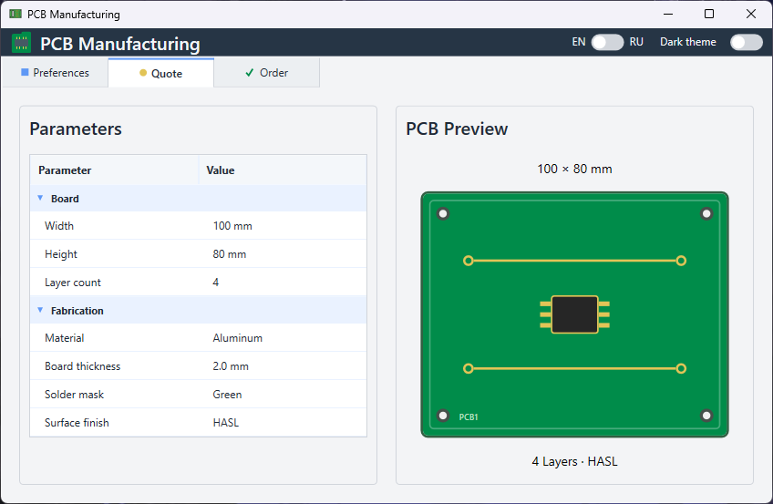
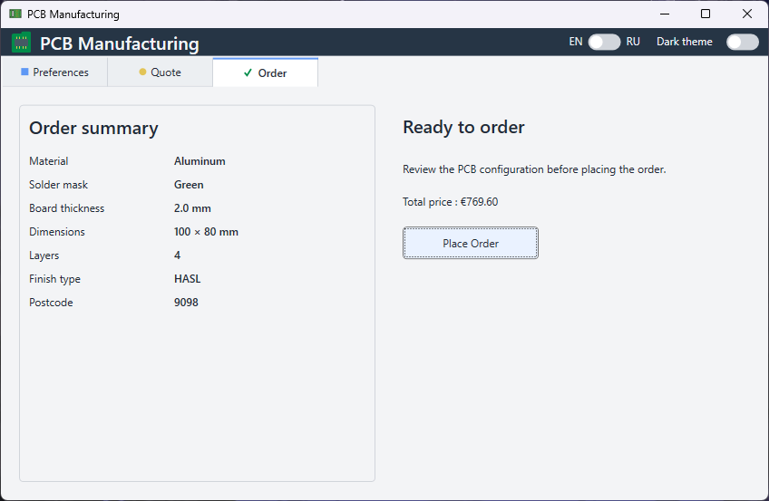
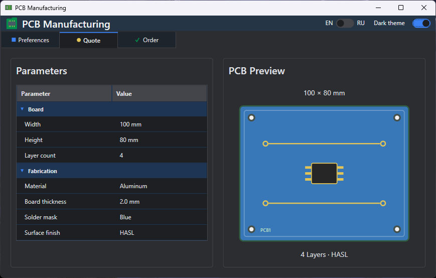

# PCB Manufacturing

A small WPF desktop application for configuring PCB manufacturing options, reviewing the resulting quote, and placing an order.

The project was created as a technical assignment and demonstrates MVVM architecture, dependency injection, validation, theming, localization, persistence, and unit testing.

## Screenshots

### Preferences


### Quote



### Order



### Quote — Dark Theme



## Features

- PCB manufacturing preferences:
  - material
  - solder mask color
  - board thickness
  - postcode
- Quote overview with grouped PCB parameters
- PCB preview that reacts to the selected configuration
- Simple order price calculation
- Order validation and confirmation
- Light and dark themes
- English and Russian localization
- Local JSON configuration persistence
- Single-instance application behavior
- Unit tests for application logic

## Build Instructions

### Requirements

- Windows
- .NET 8 SDK

### Build from the command line

Clone the repository and open the repository directory:

```bash
git clone https://github.com/AlexPalex40k/PCBManufacturing.git
cd PCBManufacturing